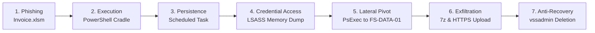

# 🚨 Splunk SIEM Incident Investigation & SOC Threat Hunting Lab
### Enterprise Breach Analysis: *Operation BlackByte*

[](https://www.splunk.com/)
[](https://csrc.nist.gov/publications/detail/sp/800-61/rev-2/final)
[](https://attack.mitre.org/)
[](https://github.com/SigmaHQ/sigma)
[]()

A comprehensive, production-grade **Security Operations Center (SOC) Incident Investigation and Threat Hunting Project** reconstructing an advanced financial ransomware and data exfiltration campaign (*"Operation BlackByte"*).

This repository contains full investigation playbooks, optimized **Splunk Search Processing Language (SPL)** queries, vendor-agnostic **Sigma detection rules**, structured **IOC feeds**, a **NIST SP 800-61r2 Incident Response Report**, an **interactive SOC dashboard**, and a **ready-to-import telemetry dataset**.

---

## 🎯 Incident Highlights & Key Metrics

* **Target Organization:** Apex Global Financial (`apex-fin.corp`)
* **Incident Severity:** **CRITICAL (P1)**
* **Initial Access Vector:** Spearphishing with weaponized macro spreadsheet (`Invoice_Q3_9942.xlsm`)
* **Impacted Assets:** `FIN-WS-014` (`10.100.20.45`, Finance Workstation), `FS-DATA-01` (`10.100.10.20`, Enterprise File Server)
* **Compromised Identities:** `APEX\jdoe` (Initial victim), `APEX\svc_backup` (High-privilege Domain Service Account)
* **Data Exfiltrated:** 88.4 MB of proprietary financial databases & employee PII over HTTPS C2 channel
* **Containment Time:** Contained within 1 hour 45 minutes of initial alert

---

## 🏗️ Attack Progression Lifecycle



---

## 📂 Repository Structure

```text
splunk-soc-incident-investigation/
├── README.md                          <-- Project Overview & Quick Start
├── docs/
│   ├── INCIDENT_REPORT.md             <-- Formal Enterprise IR Report (NIST SP 800-61)
│   ├── INVESTIGATION_PLAYBOOK.md      <-- SOC Analyst Field Guide & SPL Query Breakdown
│   ├── MITRE_ATTACK_MAPPING.md        <-- Full TTP Matrix & Defensive Mitigations
│   ├── DETECTION_ENGINEERING.md       <-- Splunk Correlation Searches & Sigma Rules
│   └── LAB_SETUP_GUIDE.md             <-- Docker, VM & Splunk BOTS Setup Guide
├── queries/
│   ├── 01_initial_access_phishing.spl <-- Phase 1 SPL Queries
│   ├── 02_execution_lolbins.spl       <-- Phase 2 SPL Queries
│   ├── 03_persistence_evasion.spl     <-- Phase 3 SPL Queries
│   ├── 04_credential_access_lsass.spl <-- Phase 4 SPL Queries
│   ├── 05_lateral_movement_discovery.spl
│   ├── 06_c2_and_data_exfiltration.spl
│   └── 07_threat_hunting_metrics.spl
├── dashboards/
│   ├── splunk_soc_dashboard.xml       <-- Native Splunk Simple XML Dashboard Source
│   └── interactive_soc_viewer.html    <-- Standalone Interactive Dark-Mode Web Dashboard
├── iocs/
│   ├── iocs.csv                       <-- Structured Threat Intelligence Table
│   ├── iocs.json                      <-- Machine-Readable Threat Intel Feed
│   └── sigma_rules.yml                <-- Production Sigma Detection Rules
└── data/
    └── sample_incident_telemetry.json <-- 1-Click Importable Dataset for Splunk
```

---

## 🔍 Investigation Quick Reference

| Phase | Core Objective | Key Telemetry | Example SPL Query |
| :--- | :--- | :--- | :--- |
| **1. Initial Access** | Identify dropped phishing file & SHA256 | Sysmon 15 / O365 | `index=incident_lab EventCode=15 TargetFilename="*Invoice*"` |
| **2. Execution** | Detect Office spawning hidden PowerShell | Sysmon 1 / PS 4104 | `index=incident_lab ParentImage="*excel.exe" Image="*powershell.exe"` |
| **3. Persistence** | Uncover malicious Scheduled Tasks | WinEventLog 4698 | `index=incident_lab EventCode=4698 \| rex field=Message "Task Name:\s+(?<TaskName>[^\r\n]+)"` |
| **4. Credential Access**| Catch unauthorized LSASS handle access | Sysmon 10 | `index=incident_lab EventCode=10 TargetImage="*lsass.exe" GrantedAccess="0x1010"` |
| **5. Lateral Movement**| Correlate Network Logon with PsExec service| WinEventLog 4624 / 7045 | `index=incident_lab EventCode=7045 ServiceName="PSEXESVC"` |
| **6. C2 & Exfil** | Measure 60s beaconing & exfiltration | stream:http / Firewall | `index=incident_lab sourcetype="stream:http" \| streamstats ...` |
| **7. Anti-Recovery** | Spot Volume Shadow Copy deletion | Sysmon 1 | `index=incident_lab Image="*vssadmin.exe" CommandLine="*delete*shadows*"` |

---

## 📊 Interactive SOC Incident Dashboard

You can explore the incident interactively without running Splunk by opening [`dashboards/interactive_soc_viewer.html`](./dashboards/interactive_soc_viewer.html) in any browser!

Features:
* 🔴 Live Attack Timeline & Progress Bar
* ⚡ Interactive SPL Query Runner & Clause Explainer
* 🗺️ MITRE ATT&CK Matrix Explorer
* 🎯 IOC Search and Copy Toolkit

---

## 🚀 Lab Deployment & Dataset Ingestion

### Fast Track (Docker):
```bash
docker run -d \
  --name splunk_incident_lab \
  -p 127.0.0.1:8000:8000 \
  -p 127.0.0.1:8088:8088 \
  -e "SPLUNK_START_ARGS=--accept-license" \
  -e "SPLUNK_PASSWORD=SplunkPassword2026!" \
  splunk/splunk:latest
```
1. Open `http://127.0.0.1:8000` (Login: `admin` / `SplunkPassword2026!`).
2. Create Index `incident_lab` in **Settings > Indexes**.
3. Upload [`data/sample_incident_telemetry.json`](./data/sample_incident_telemetry.json) in **Settings > Add Data**.
4. Run any query from the `queries/` directory!

For detailed instructions including Splunk BOTS mapping, see the [Lab Setup Guide](./docs/LAB_SETUP_GUIDE.md).

---

## 👤 Author
**Devanshu Grover**  
*MSc Cybersecurity | AWS Certified Cloud Practitioner | Security Operations*  
* [LinkedIn](https://www.linkedin.com/in/devanshugrover-22b097208)
* [GitHub](https://github.com/)
