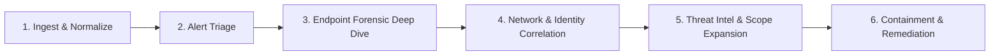

# 📖 SOC Analyst Threat Hunting & Investigation Playbook
## Operation BlackByte Triage & SPL Reference Guide

This playbook provides the operational methodology, investigative workflow, and comprehensive Splunk Search Processing Language (SPL) queries used by Tier 1/Tier 2 SOC Analysts to triage, hunt, and reconstruct enterprise cyber attacks.

---

## 🎯 Methodology: The 6-Stage SOC Investigation Lifecycle



---

## 🛠️ Key Splunk SPL Commands & Functions Reference

| SPL Command / Function | Purpose in Security Investigation | Example in this Playbook |
| :--- | :--- | :--- |
| `rex` | Extracts regular expressions into custom searchable fields at search-time. | `\| rex field=CommandLine "SHA256=(?<sha256>[A-Fa-f0-9]{64})"` |
| `eval` / `case()` | Dynamically categorizes events, performs math, or creates condition-based labels. | `\| eval RiskLevel=case(EventCode==10, "CRITICAL", 1=1, "INFO")` |
| `stats` / `eventstats` | Calculates statistical aggregates (`count`, `values()`, `avg()`, `stdev()`). | `\| stats count by Image, CommandLine` |
| `streamstats` | Calculates running or sliding-window metrics across ordered events. | `\| streamstats current=f window=1 last(_time) as prev_time` |
| `timechart` | Aggregates data into chronological time buckets for anomaly detection. | `\| timechart span=15m sum(MB_Sent) by dest_ip` |
| `coalesce()` | Merges multiple fields into one unified field, picking the first non-null. | `\| eval Source_IP=coalesce(IpAddress, Workstation_Name)` |
| `transaction` | Groups related events across different log sources sharing a session ID. | `\| transaction maxspan=5m Computer, User` |

---

## 🔍 Investigation Step-by-Step Triage

### 1. Phishing & Initial Vector Triage

#### Analytical Goal:
Confirm file origin, identify sender details, determine if the attachment was executed, and identify any other recipients across the organization.

```spl
index=incident_lab (sourcetype="ms:o365:reporting:messagetrace" OR sourcetype="proofpoint:messages")
| search attachment_name="Invoice_Q3_9942.xlsm" OR recipient_address="jdoe@apex-fin.com"
| stats count min(_time) as first_seen max(_time) as last_seen by sender_address, recipient_address, subject, attachment_name, sender_ip
| eval first_seen=strftime(first_seen, "%Y-%m-%d %H:%M:%S"), last_seen=strftime(last_seen, "%Y-%m-%d %H:%M:%S")
| table first_seen, sender_address, recipient_address, subject, attachment_name, sender_ip
```

---

### 2. Office Process Execution & PowerShell Lineage

#### Analytical Goal:
Detect the parent-child relationship between Microsoft Office and Windows scripting engines, extract command lines, and decode base64 parameters.

```spl
index=incident_lab sourcetype="XmlWinEventLog:Microsoft-Windows-Sysmon/Operational" EventCode=1
| search ParentImage="*\\excel.exe" OR ParentImage="*\\winword.exe"
| eval SuspiciousChild=case(
    match(Image, "(?i)powershell\.exe"), "PowerShell Spawned",
    match(Image, "(?i)cmd\.exe"), "Command Prompt Spawned",
    match(Image, "(?i)wscript\.exe"), "WScript Spawned",
    1=1, "Other Child Process"
  )
| table _time, Computer, User, ParentImage, ParentProcessId, Image, ProcessId, CommandLine, SuspiciousChild
| sort - _time
```

#### Base64 Payload Extraction:
```spl
index=incident_lab sourcetype="XmlWinEventLog:Microsoft-Windows-Sysmon/Operational" EventCode=1 Image="*\\powershell.exe"
| search CommandLine="*-enc*" OR CommandLine="*-EncodedCommand*" OR CommandLine="*-e *"
| rex field=CommandLine "(?i)-enc(odedcommand)?\s+(?<encoded_payload>[A-Za-z0-9+/=]+)"
| eval payload_length=len(encoded_payload)
| table _time, Computer, User, ProcessId, CommandLine, encoded_payload, payload_length
```

---

### 3. Antivirus Tampering & Scheduled Task Persistence

#### Analytical Goal:
Identify alterations to Windows Defender settings and persistent task creation using Windows Security Event ID 4698.

```spl
index=incident_lab sourcetype="WinEventLog:Security" EventCode=4698
| rex field=Message "Task Name:\s+(?<TaskName>[^\r\n]+)"
| rex field=Message "Task Content:\s+(?<TaskContent>[^\r\n]+)"
| rex field=Message "Subject:\s+.*?Account Name:\s+(?<CreatorUser>[^\r\n]+)"
| eval IsSuspicious=if(match(TaskContent, "(?i)(powershell|cmd|wscript|cscript|mshta|certutil|temp|appdata)"), "HIGH RISK", "Normal")
| table _time, Computer, CreatorUser, TaskName, IsSuspicious, TaskContent
| where IsSuspicious="HIGH RISK"
```

---

### 4. Credential Access & LSASS Process Memory Dumping

#### Analytical Goal:
Detect unauthorized process access to `lsass.exe` using Sysmon Event ID 10 with high-privilege access masks (`0x1010` / `0x1FFFFF`).

```spl
index=incident_lab sourcetype="XmlWinEventLog:Microsoft-Windows-Sysmon/Operational" EventCode=10
| search TargetImage="*\\lsass.exe"
| eval GrantedAccess_Hex=tostring(GrantedAccess)
| eval SuspiciousAccess=case(
    GrantedAccess IN ("0x1FFFFF", "0x1F3FFF"), "Full Access Rights (Mimikatz / High Risk)",
    GrantedAccess IN ("0x1010", "0x1410", "0x143a"), "Memory Read / MiniDump Rights (comsvcs / procdump)",
    1=1, "Standard Query Access"
  )
| where SuspiciousAccess!="Standard Query Access"
| table _time, Computer, SourceUser, SourceImage, SourceProcessId, TargetImage, GrantedAccess, SuspiciousAccess, CallTrace
| sort - _time
```

---

### 5. Lateral Movement & Remote Service Execution

#### Analytical Goal:
Correlate Network Logons (**Event ID 4624, Logon Type 3**) with new service installations (**Event ID 7045**) to detect PsExec / SMB pivoting.

```spl
index=incident_lab (sourcetype="WinEventLog:System" EventCode=7045) OR (sourcetype="WinEventLog:Security" EventCode=4697)
| rex field=Message "Service Name:\s+(?<ServiceName>[^\r\n]+)"
| rex field=Message "Service File Name:\s+(?<ServiceFileName>[^\r\n]+)"
| rex field=Message "Service Type:\s+(?<ServiceType>[^\r\n]+)"
| table _time, Computer, ServiceName, ServiceFileName, ServiceType
| sort - _time
```

---

### 6. C2 Beaconing Detection (Interval & Jitter Analysis)

#### Analytical Goal:
Perform statistical modeling over outbound HTTP connections to prove automated command-and-control beaconing.

```spl
index=incident_lab sourcetype="stream:http" dest_ip="198.51.100.77"
| sort 0 _time
| streamstats current=f window=1 last(_time) as prev_time by src_ip, dest_ip
| eval time_delta=_time - prev_time
| where isnotnull(time_delta) AND time_delta > 0
| stats count, avg(time_delta) as avg_interval, stdev(time_delta) as jitter, min(time_delta) as min_interval, max(time_delta) as max_interval by src_ip, dest_ip, http_method, uri
| eval avg_interval=round(avg_interval, 2), jitter=round(jitter, 2)
| table src_ip, dest_ip, http_method, uri, count, avg_interval, jitter, min_interval, max_interval
```

---

### 7. Anti-Recovery & Backup Destruction Detection

#### Analytical Goal:
Detect volume shadow copy deletion and recovery policy modification.

```spl
index=incident_lab sourcetype="XmlWinEventLog:Microsoft-Windows-Sysmon/Operational" EventCode=1
| search (Image="*\\vssadmin.exe" AND CommandLine="*delete*shadows*")
      OR (Image="*\\wmic.exe" AND CommandLine="*shadowcopy*delete*")
      OR (Image="*\\bcdedit.exe" AND (CommandLine="*recoveryenabled*no*" OR CommandLine="*ignoreallfailures*"))
| eval AntiRecoveryTactic=case(
    match(Image, "(?i)vssadmin\.exe"), "VSSAdmin: Shadow Copy Deletion",
    match(Image, "(?i)wmic\.exe"), "WMIC: Shadow Copy Deletion",
    match(Image, "(?i)bcdedit\.exe"), "BCDEdit: Disable Windows Recovery",
    1=1, "Generic Backup Tampering"
  )
| table _time, Computer, User, Image, CommandLine, AntiRecoveryTactic
| sort - _time
```
